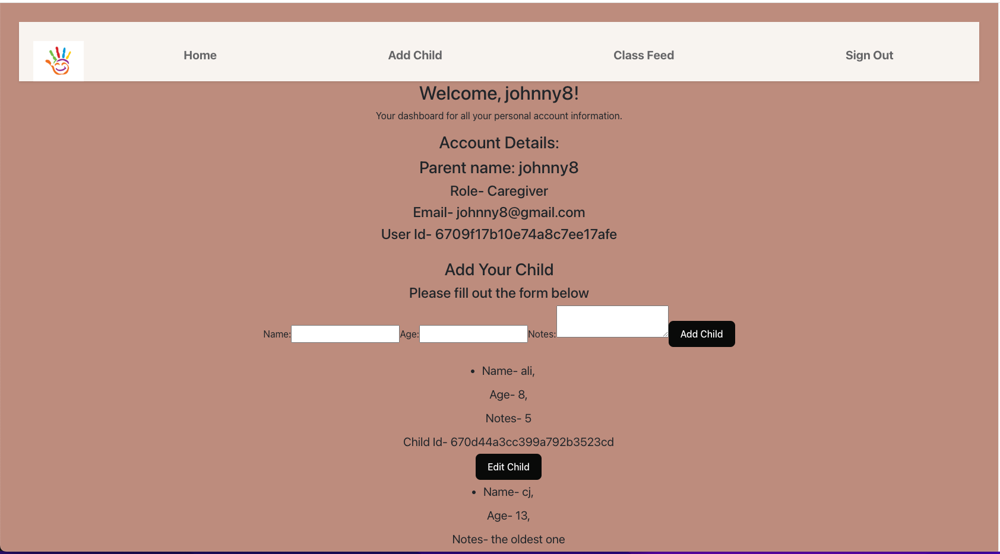

# React + Vite
Childcare-app-project-3-react

My project 3 app is a childcare application. The purpose and functionality of my app is to first, create an account, sign in. You hit the landing page and there is a nav bar to explore to your home page which is the dashboard, a page to add a child, a page to add a post to the class newsfeed, and to signout. on the home/dashboard page you can see all of your account information and also the children you have added for childcare and their information. You can also edit or delete your account information and your childs information. You can also go to the Class feed page where you can see posts posted by users about how a day in class has gone or any important information. Both front and back end have full CRUD functionality. It is not as good as I intended in the beginning of this project, but it meets requirements and I will be working on this often to get it where I want it to be for my portfolio.

I feel like i learned a lot on this project as I struggled very much. I hope to do more projects full stack to get a better understanding and grasp the process.

Stretch goals I would like for this app i would like to be able to add photos to a post, like a post, able to add comments to a post and the user able to edit and delete comments. I would like to add a personal message from parent to caregiver. I want to add an admin to the app. I would also to have more personal detail for the user and child .

Technologies used:
javascript, css, ejs, html, mongobd, mongoose, json, express, vite, react

Researched on google, webmdn, mongoose website, shecodes, youtube, excalidraw

